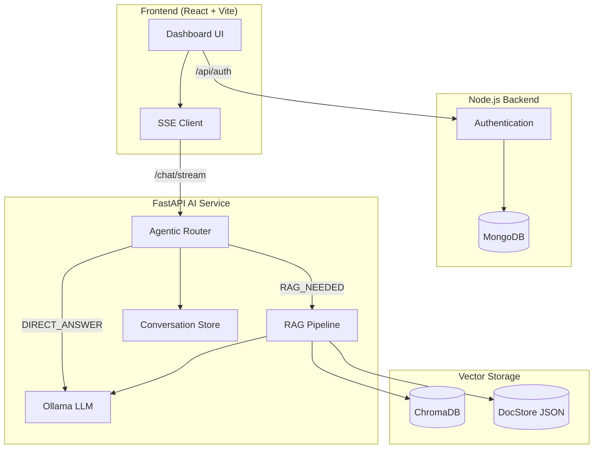
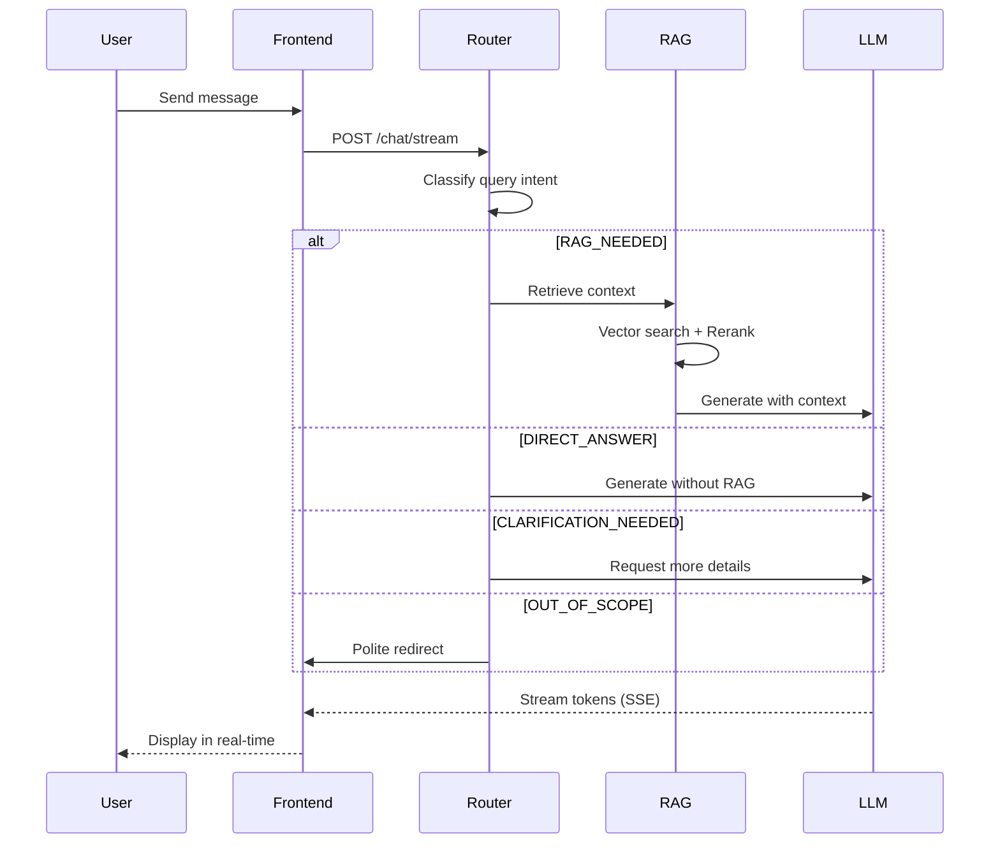
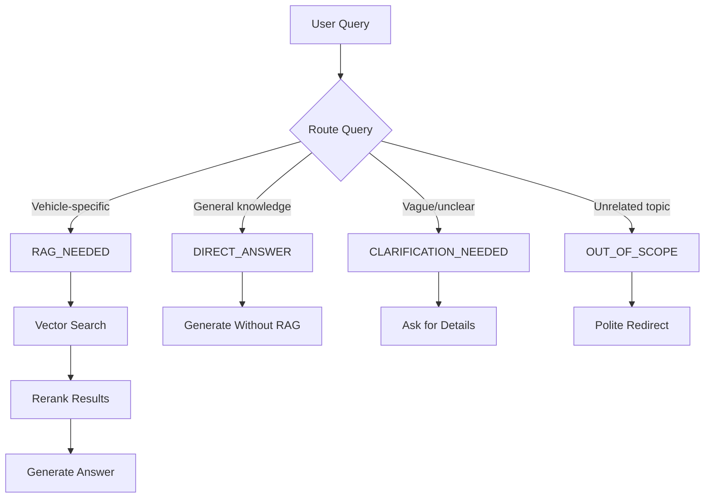
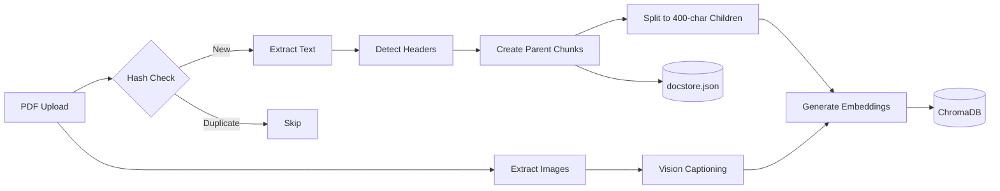
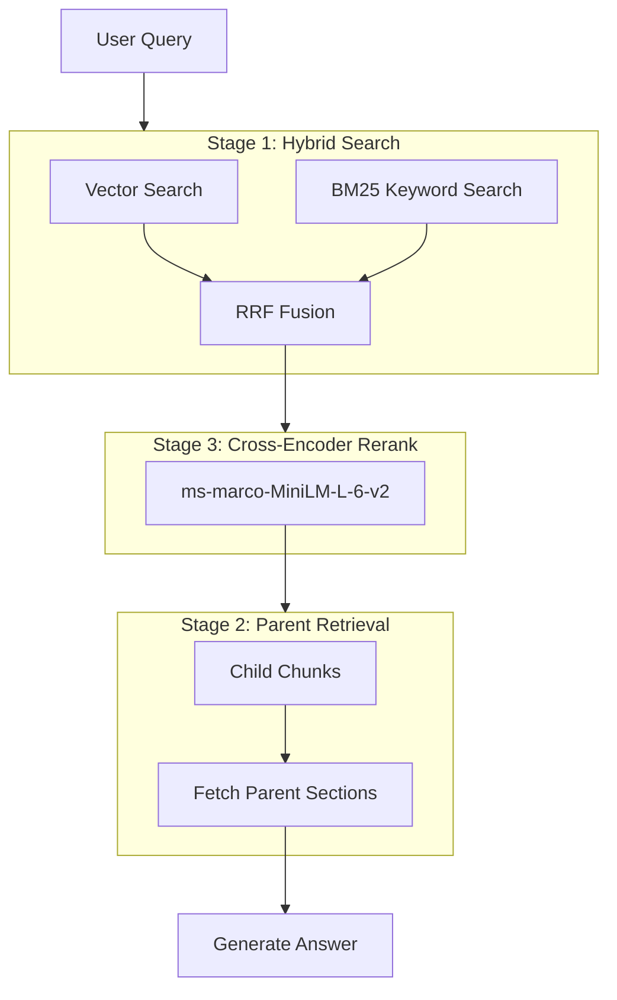

# Mecanic-IA: Agentic RAG for Automotive Manuals

An intelligent Retrieval-Augmented Generation system for querying Dacia vehicle repair manuals. Features real-time streaming responses, multi-turn conversation memory, and an agentic router that decides whether to retrieve information or answer directly.

## Table of Contents

- [Features](#features)
- [System Architecture](#system-architecture)
- [Agentic Router](#agentic-router)
- [Installation](#installation)
- [Usage](#usage)
- [API Reference](#api-reference)
- [Project Structure](#project-structure)
- [Technical Stack](#technical-stack)
- [Configuration](#configuration)

---

## Features

| Feature | Description |
|---------|-----------|
| **3-Stage Retrieval** | Hybrid search → Parent context → Cross-encoder reranking |
| **Hybrid Search** | BM25 keyword + Vector semantic search with RRF fusion |
| **Agentic Routing** | LLM decides whether to use RAG, answer directly, or request clarification |
| **SSE Streaming** | Real-time token-by-token response streaming |
| **Conversation Memory** | Multi-turn context preserved across messages |
| **Multimodal Processing** | Extracts and processes both text and images from PDFs |
| **Parent-Child Chunking** | Small chunks for search accuracy, parent sections for full context |
| **Persistent Storage** | ChromaDB for vectors, BM25 index, JSON for parent documents |

---

## System Architecture

### High-Level Overview



### Request Flow



---

## Agentic Router

The system uses an intelligent query router that classifies user intent before deciding how to handle the request.

### Routing Decisions



### Route Descriptions

| Route | Trigger | Behavior |
|-------|---------|----------|
| `RAG_NEEDED` | Requires manual lookup | Full retrieval pipeline with sources |
| `DIRECT_ANSWER` | General automotive knowledge | Skip RAG, faster response |
| `CLARIFICATION_NEEDED` | Vague query like "fix it" | Ask user for specifics |
| `OUT_OF_SCOPE` | Non-vehicle topics | Politely redirect to vehicle questions |

---

## Ingestion Pipeline



### Chunking Strategy

**Parent Chunks:**
- Split on detected section headers
- Stored in docstore.json with full content
- Used for context enrichment after retrieval

**Child Chunks:**
- ~600 tokens (~2400 chars) with 100-token overlap
- Embedded with all-MiniLM-L6-v2
- Stored in ChromaDB with parent_id reference
- Also indexed in BM25 for keyword search

---

## Retrieval Pipeline

The system uses a **3-Stage Retrieval Pipeline** optimized for automotive manuals:



### Stage Details

| Stage | Purpose | Implementation |
|-------|---------|----------------|
| **Stage 1: Hybrid Search** | Handle both semantic and keyword queries | Vector + BM25 combined via Reciprocal Rank Fusion |
| **Stage 2: Parent Context** | Ensure complete context (no missing safety steps) | Child finds the match, parent provides full section |
| **Stage 3: Reranking** | Move truly relevant results to top | Cross-encoder rescores top candidates |

### Why Hybrid Search?

- **Vector Search** handles: *"How do I stop my engine from overheating?"*
- **BM25 Keyword** handles: *"DF025 fault code"* or *"M6 bolt torque spec"*
- **RRF Fusion** combines both for best of both worlds

---

## Installation

### Prerequisites

- Python 3.9+
- Node.js 18+
- Ollama
- MongoDB (for authentication)

### Backend Setup

```bash
# Clone repository
git clone https://github.com/yourusername/mecanic-ia.git
cd mecanic-ia

# Create virtual environment
python -m venv venv
source venv/bin/activate  # Windows: venv\Scripts\activate

# Install Python dependencies
cd MechanicTroubleShooter/FastApi
pip install -r requirements.txt

# Pull Ollama models
ollama pull llama3.1
ollama pull llava-phi3

# Start FastAPI server
uvicorn main:app --reload --port 8000
```

### Frontend Setup

```bash
cd MechanicTroubleShooter/frontend
npm install
npm run dev
```

### Node.js Backend (Authentication)

```bash
cd MechanicTroubleShooter/backend
npm install
npm start
```

---

## Usage

### Web Interface

1. Navigate to http://localhost:5173
2. Register/Login
3. Start chatting with the AI assistant

### API Examples

**Streaming Chat:**
```bash
curl -N -X POST http://localhost:8000/chat/stream \
  -H "Content-Type: application/json" \
  -d '{"query": "How do I check the oil level?", "conversation_id": null}'
```

**Upload Manual:**
```bash
curl -X POST http://localhost:8000/ingest \
  -F "file=@manual.pdf"
```

**System Stats:**
```bash
curl http://localhost:8000/stats
```

---

## API Reference

### Endpoints

| Method | Endpoint | Description |
|--------|----------|-------------|
| GET | `/` | Health check and system status |
| GET | `/health` | Component health status |
| POST | `/ingest` | Upload and process PDF manual |
| POST | `/chat` | Synchronous chat (non-streaming) |
| POST | `/chat/stream` | Streaming chat with SSE |
| GET | `/stats` | Database statistics |
| GET | `/demo/{id}` | Run demo query |
| DELETE | `/reset` | Clear all data |

### SSE Event Format

```
event: metadata
data: {"conversation_id": "uuid", "num_sources": 5, "route": "rag"}

event: token
data: According

event: token
data:  to

event: done
data:
```

---

## Project Structure

```
MechanicTroubleShooter/
├── FastApi/                    # AI Backend
│   ├── main.py                 # FastAPI application entry
│   ├── api/
│   │   └── routes.py           # API endpoints
│   ├── schemas/
│   │   └── models.py           # Pydantic models
│   ├── services/
│   │   ├── ingestion/          # PDF processing
│   │   │   ├── pipeline.py     # Main ingestion orchestrator
│   │   │   ├── pdf_processor.py
│   │   │   ├── chunking.py
│   │   │   └── vision.py
│   │   ├── retrieval/          # RAG logic
│   │   │   ├── rag.py          # 3-stage retrieval pipeline
│   │   │   ├── hybrid_search.py # BM25 + Vector + RRF fusion
│   │   │   └── reranker.py     # Cross-encoder reranking
│   │   ├── storage/            # Data persistence
│   │   │   ├── vector.py       # ChromaDB operations
│   │   │   ├── document.py     # Parent document store
│   │   │   └── conversation.py # Conversation memory
│   │   └── llm/                # Language models
│   │       ├── client.py       # Ollama API client
│   │       └── router.py       # Agentic query router
│   ├── chroma_db/              # Vector database + BM25 index
│   └── chroma_parent_child/    # Document store
│       └── docstore.json
│
├── frontend/                   # React Frontend
│   ├── src/
│   │   ├── pages/
│   │   │   └── Dashboard.jsx   # Chat interface
│   │   ├── api/
│   │   │   └── axios.js        # API client
│   │   └── context/
│   │       └── AuthContext.jsx
│   └── vite.config.js          # Vite with proxy config
│
└── backend/                    # Node.js Auth Backend
    ├── app.js
    ├── controllers/
    ├── models/
    └── routers/
```

---

## Technical Stack

### AI/ML Components

| Component | Technology | Purpose |
|-----------|------------|--------|
| Embeddings | all-MiniLM-L6-v2 | 384-dim text vectors |
| Vector DB | ChromaDB | Semantic similarity search |
| BM25 Index | rank_bm25 | Keyword search for technical terms |
| Reranker | ms-marco-MiniLM-L-6-v2 | Cross-encoder scoring |
| LLM | Llama 3.1 (8B) | Text generation |
| Vision | llava-phi3 | Image captioning |
| PDF Parser | PyMuPDF | Text/image extraction |

### Backend

| Component | Technology |
|-----------|------------|
| AI API | FastAPI |
| Streaming | SSE (sse-starlette) |
| Auth API | Express.js |
| Auth DB | MongoDB |

### Frontend

| Component | Technology |
|-----------|------------|
| Framework | React 18 |
| Build Tool | Vite |
| Styling | TailwindCSS |
| Animations | Framer Motion |
| Icons | Lucide React |

---

## Configuration

### Environment Variables

```env
# .env (FastApi directory)
OLLAMA_URL=http://localhost:11434/api/generate
CHROMA_PERSIST_DIR=./chroma_db

# .env (backend directory)
MONGODB_URI=mongodb://localhost:27017/mecanic-ia
JWT_SECRET=your-secret-key
```

### Model Configuration

Edit `services/llm/client.py`:

```python
OLLAMA_URL = "http://localhost:11434/api/generate"
VISION_MODEL = "llava-phi3"  # For image captioning
```

Edit `services/llm/router.py` and `client.py`:

```python
model = "llama3.1"  # Main text generation model
```

### Retrieval Tuning

Edit `api/routes.py`:

```python
k = 10  # Number of final sources
child_k = 50  # Candidates before reranking
```

---


## Acknowledgments

- LangChain for document processing
- Ollama for local LLM inference
- ChromaDB for vector storage
- Sentence Transformers for embeddings
