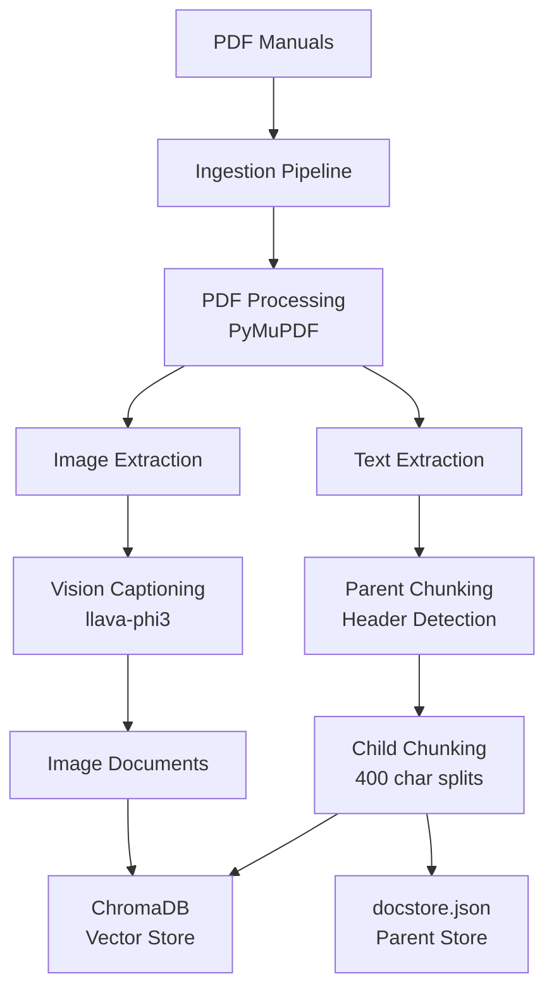
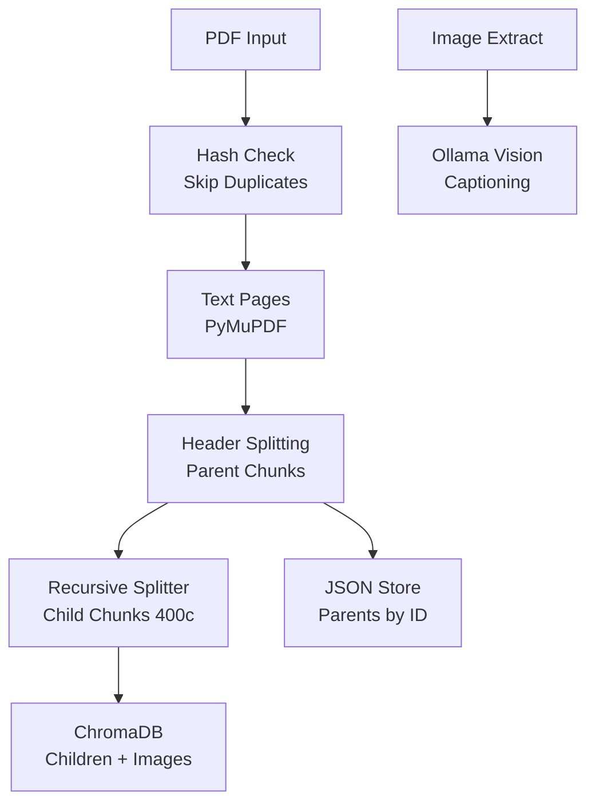
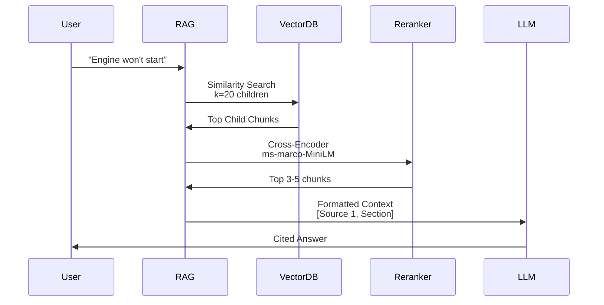
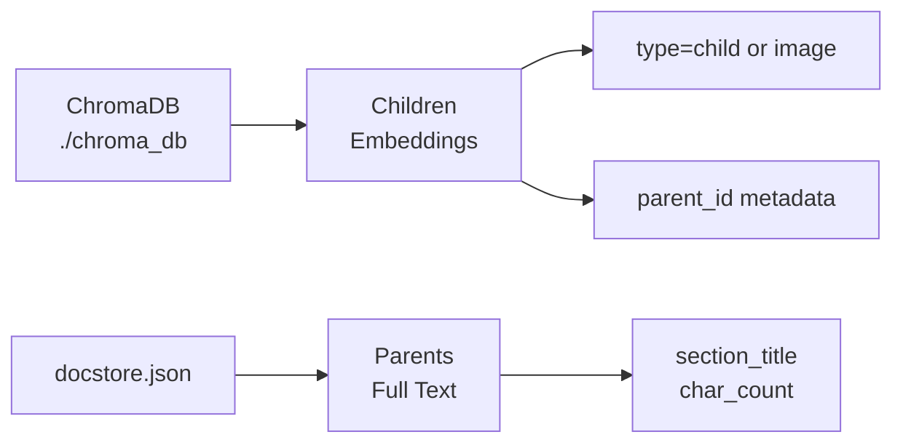

# Mecanic-IA: Multimodal RAG for Automotive Manuals

A  Retrieval-Augmented Generation (RAG) system designed for querying car repair manuals. The system combines text search, image captioning, and intelligent retrieval strategies to provide accurate answers to automotive troubleshooting questions.

## Table of Contents

- [Features](#features)
- [Architecture](#architecture)
- [Installation](#installation)
- [Usage](#usage)
- [API Documentation](#api-documentation)
- [Configuration](#configuration)
- [Project Structure](#project-structure)
- [Technical Details](#technical-details)
- [Performance](#performance)
- [Contributing](#contributing)
- [License](#license)

## Features

- **Multimodal Processing**: Extracts and processes both text and images from PDF manuals
- **Semantic Reranking**: Uses cross-encoder models for accurate relevance scoring
- **Parent-Child Chunking**: Hierarchical document structure for optimal retrieval
- **Vision Integration**: Automatic image captioning using Llama 3.2 Vision
- **Fast Queries**: Sub-500ms response times for typical queries
- **Persistent Storage**: ChromaDB for vectors, JSON for parent documents
- **Production Ready**: Error handling, logging, and graceful degradation

## Architecture

### System Overview



### Ingestion Pipeline

The ingestion pipeline processes PDF manuals through several stages:

1. **PDF Input**: Accepts automotive repair manual PDFs
2. **Hash Check**: SHA256 deduplication to skip already-processed files
3. **Text Extraction**: Extracts text content using PyMuPDF
4. **Header Detection**: Identifies section headers (e.g., "10A ENGINE", "5.45 FAULTS")
5. **Parent Chunking**: Creates large semantic chunks based on headers
6. **Child Chunking**: Splits parents into 400-character searchable chunks
7. **Image Processing**: Extracts diagrams and generates captions
8. **Storage**: Stores children/images in ChromaDB, parents in JSON



### Retrieval Pipeline

The retrieval system uses a multi-stage process for optimal accuracy:



**Retrieval Stages:**

1. **Vector Search**: Retrieve candidate chunks using embedding similarity
2. **Reranking**: Score chunks with cross-encoder for true relevance
3. **Selection**: Pick top 3-5 chunks for context
4. **Generation**: Generate answer with citations using LLM

### Storage Architecture



**Vector Store (ChromaDB):**
- Stores child chunks and image descriptions
- 384-dimensional embeddings (all-MiniLM-L6-v2)
- Metadata: parent_id, section_title, source_file, type
- Local persistence in `./chroma_db`

**Document Store (JSON):**
- Stores complete parent documents
- Mapped by parent_id for quick lookup
- Contains full section text and metadata
- Persisted in `./chroma_parent_child/docstore.json`

## Installation

### Prerequisites

- Python 3.9 or higher
- Ollama (for LLM and vision models)
- 8GB+ RAM recommended
- GPU optional (speeds up vision processing)

### Setup Steps

1. **Clone the repository**
```bash
git clone https://github.com/yourusername/mecanic-ia.git
cd mecanic-ia
```

2. **Create virtual environment**
```bash
python -m venv venv
source venv/bin/activate  # On Windows: venv\Scripts\activate
```

3. **Install dependencies**
```bash
pip install -r requirements.txt
```

4. **Install and start Ollama**
```bash
# Install Ollama from https://ollama.ai
ollama serve
```

5. **Pull required models**
```bash
ollama pull llama3.2:3b
ollama pull llama3.2-vision
```

6. **Run the application**
```bash
uvicorn main:app --reload
```

The API will be available at `http://localhost:8000`

## Usage

### Quick Start

1. **Health Check**
```bash
curl http://localhost:8000/
```

2. **Upload a PDF Manual**
```bash
curl -X POST http://localhost:8000/ingest \
  -F "file=@path/to/manual.pdf"
```

3. **Query the System**
```bash
curl -X POST http://localhost:8000/chat \
  -H "Content-Type: application/json" \
  -d '{"query": "Why won'\''t my engine start?"}'
```

4. **Run Demo Scenarios**
```bash
curl http://localhost:8000/demo/won't_start
```

### Interactive API Documentation

Visit `http://localhost:8000/docs` for the Swagger UI interface where you can:
- Test all endpoints interactively
- View request/response schemas
- Download API specifications

## API Documentation

### Endpoints

| Method | Endpoint | Description |
|--------|----------|-------------|
| GET | `/` | Health check and system statistics |
| GET | `/demos` | List available demo scenarios |
| GET | `/demo/{id}` | Run a specific demo query |
| POST | `/ingest` | Upload and process a PDF manual |
| POST | `/chat` | Query the RAG system |
| GET | `/stats` | Get database statistics |
| DELETE | `/reset` | Clear all data from database |

### Request/Response Examples

**Chat Query**
```bash
POST /chat
{
  "query": "How do I check the oil level?"
}

Response:
{
  "answer": "According to Source 1 [LUBRICATION SYSTEM]...",
  "sources": [
    {
      "source_num": 1,
      "title": "LUBRICATION SYSTEM",
      "file": "manual.pdf",
      "preview": "Check oil level with dipstick..."
    }
  ],
  "num_sources": 3,
  "context_chars": 1847
}
```

**Ingest PDF**
```bash
POST /ingest
Content-Type: multipart/form-data
file: manual.pdf

Response:
{
  "message": "Successfully processed manual.pdf",
  "pages": 245,
  "chunks": 1823,
  "images": 67
}
```

## Configuration

### Core Settings

Edit `services/rag.py` to adjust retrieval parameters:

```python
# Retrieval Configuration
CHILD_K = 20            # Candidates for reranking
TOP_K = 3               # Final chunks for context

# Chunking Configuration
CHUNK_SIZE = 400        # Child chunk size (characters)
CHUNK_OVERLAP = 50      # Overlap between chunks
```

### Model Configuration

Models are loaded from Ollama. To change models:

```python
# services/llm/client.py
LLM_MODEL = "llama3.2:3b"           # Text generation
VISION_MODEL = "llama3.2-vision"    # Image captioning

# services/storage/vector.py
EMBEDDING_MODEL = "all-MiniLM-L6-v2"  # Text embeddings

# services/retrieval/reranker.py
RERANKER_MODEL = "cross-encoder/ms-marco-MiniLM-L-6-v2"  # Reranking
```

## Project Structure

```
MechanicTroubleShooter/
├── services/
│   ├── ingest/
│       ├── chunking.py
        ├── pdf_processor.py
        ├── pipeline.py
        └── vision.py            
│   ├── retrieval/
│   │   ├── reranker.py
        └──  rag.py        
│   ├── storage/
│   │   ├── vector.py         
│   │   └── document.py        
│   └── llm/
│       └── client.py
          
├── data/                      
├── chroma_db/                
├── chroma_parent_child/       
│   ├── docstore.json
    └── image_captions_cache.json          
├── main.py                    
├── requirements.txt           
├── README.md                  
└── .gitignore
```

## Technical Details

### Tech Stack

| Component | Technology | Purpose |
|-----------|-----------|---------|
| **Embeddings** | all-MiniLM-L6-v2 | Convert text to 384-dim vectors |
| **Vector DB** | ChromaDB | Store and search embeddings |
| **Reranker** | ms-marco-MiniLM-L-6-v2 | Re-score relevance with cross-encoder |
| **LLM** | Llama 3.2 3B | Generate natural language answers |
| **Vision** | Llama 3.2 Vision | Caption diagrams and images |
| **PDF Parser** | PyMuPDF (fitz) | Extract text and images from PDFs |
| **API** | FastAPI | REST API framework |
| **Frontend** | Next.js + Tailwind | Web interface (optional) |

### Chunking Strategy

**Parent Chunks:**
- Created by splitting on detected section headers
- Typically 2-10 pages of content
- Stored in `docstore.json` with metadata
- Used for full context when needed

**Child Chunks:**
- 400 characters with 50-character overlap
- Embedded and stored in ChromaDB
- Linked to parents via `parent_id` metadata
- Used for precise vector search


### Reranking Process

**Stage 1: Vector Search**
- Fast bi-encoder embeddings
- Retrieves candidates in <100ms
- Good recall, moderate precision

**Stage 2: Cross-Encoder Reranking**
- Scores query + document pairs
- Much more accurate than embeddings
- Selects top 3-5 for final context


## Performance

### Benchmarks

| Metric | Value | Notes |
|--------|-------|-------|
| **PDF Ingestion** | 2-5 min/100 pages | With GPU vision processing |
| **Query Latency** | 300-500ms | Child-direct strategy |
| **Search** | 50-100ms | Vector similarity search |
| **Reranking** | 100-200ms | Cross-encoder scoring |
| **LLM Generation** | 100-200ms | Answer generation |
| **Context Size** | 1.2-2k tokens | Typically 3-5 chunks |
| **Storage per Manual** | ~50MB | 200-page PDF with images |


## Demo Scenarios

The system includes pre-configured demo queries:

| ID | Query | Expected Response |
|----|-------|-------------------|
| `won't_start` | "Engine won't start, lights work" | Check starter motor, immobiliser system |
| `engine_smoke` | "Smoke coming from hood" | Stop vehicle immediately, contact dealer |
| `dpf_blocked` | "DPF warning light on" | DPF regeneration procedure steps |

Run demos:
```bash
curl http://localhost:8000/demo/won't_start
curl http://localhost:8000/demo/engine_smoke
curl http://localhost:8000/demo/dpf_blocked
```
### Testing

```bash
# Run manual tests
python -m pytest tests/

# Test specific endpoint
curl -X POST http://localhost:8000/chat \
  -H "Content-Type: application/json" \
  -d '{"query": "test query"}'
```


## Acknowledgments

- Built with [LangChain](https://github.com/langchain-ai/langchain)
- Powered by [Ollama](https://ollama.ai)
- Vector storage by [ChromaDB](https://www.trychroma.com/)
- Embeddings from [Sentence Transformers](https://www.sbert.net/)

