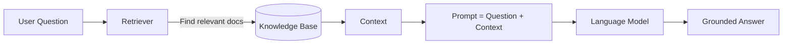
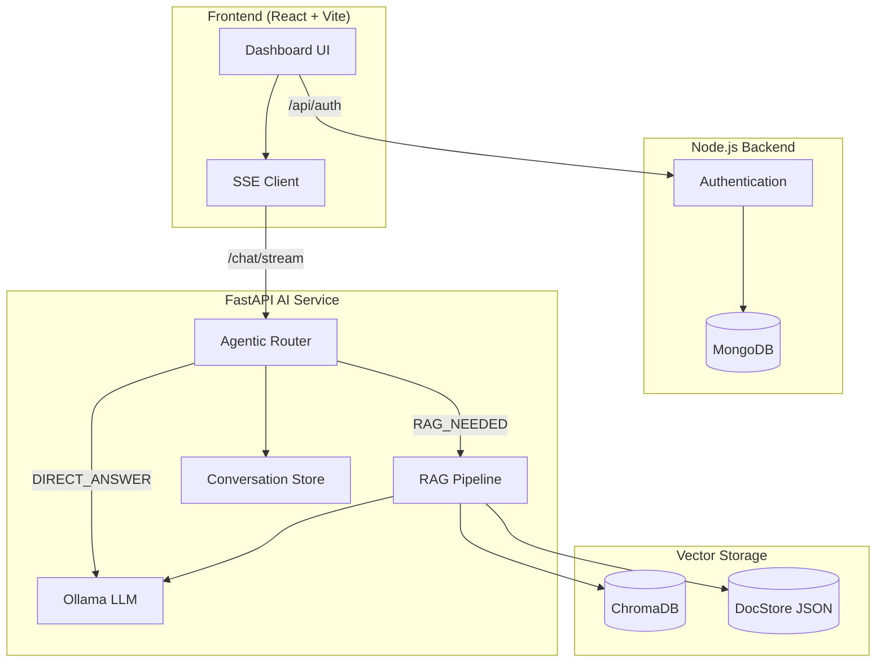
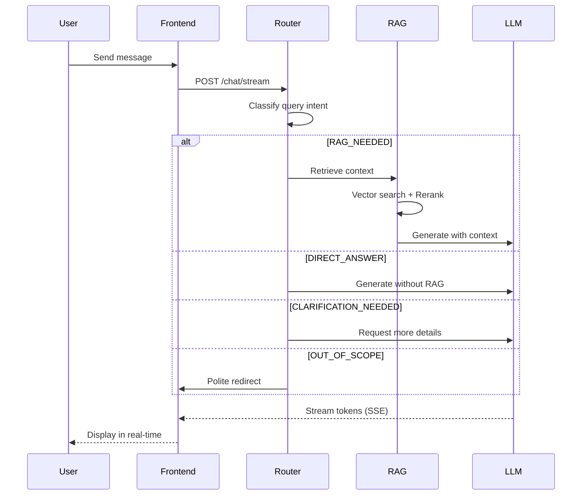
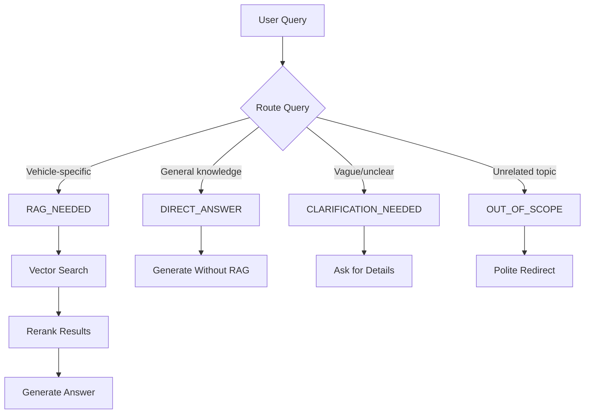
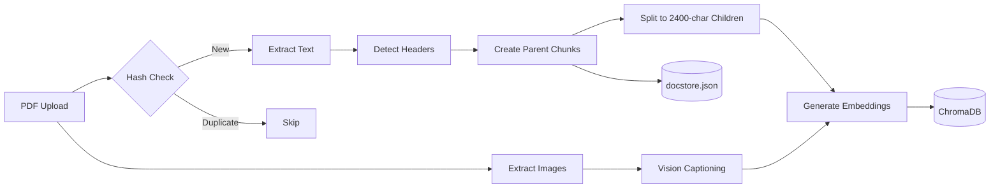
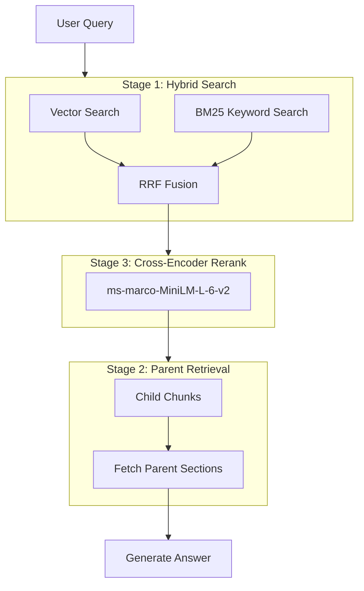
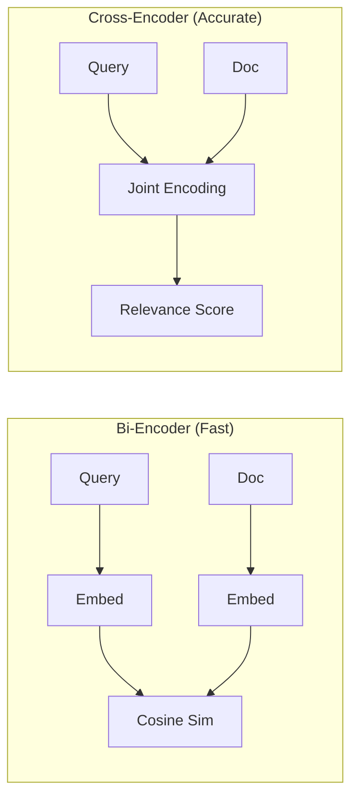

# Mecanic-IA: Agentic RAG for Automotive Manuals

An intelligent Retrieval-Augmented Generation system for querying Dacia vehicle repair manuals. Features real-time streaming responses, multi-turn conversation memory, and an agentic router that decides whether to retrieve information or answer directly.

## Table of Contents

- [Overview & Problem Statement](#overview--problem-statement)
- [Features](#features)
- [System Architecture](#system-architecture)
- [What is RAG?](#what-is-rag)
- [Agentic Router](#agentic-router)
- [Installation](#installation)
- [Usage](#usage)
- [API Reference](#api-reference)
- [Project Structure](#project-structure)
- [Technical Stack](#technical-stack)
- [Configuration](#configuration)
- [Performance](#performance)
- [References & Data Sources](#references--data-sources)
- [Acknowledgments](#acknowledgments)
- [Glossary](#glossary)

---

## Overview & Problem Statement

### The Challenge

Automotive technicians and mechanics face significant challenges when working with vehicle repair manuals:

**Information Overload**: Modern vehicle repair manuals can span thousands of pages across multiple documents (service manuals, wiring diagrams, maintenance schedules, parts catalogs). Finding the right procedure for a specific repair task can take 10-30 minutes of manual searching.

**Scattered Knowledge**: Critical information is often distributed across different sections and documents. For example, a brake system repair might require:
- The main repair procedure from the service manual
- Torque specifications from a separate technical data sheet  
- Wiring diagrams from the electrical manual
- Safety precautions from yet another section

**Technical Language Barrier**: Manuals use technical terminology and part codes (e.g., "DF025 fault code", "M6x1.0 bolt") that don't always match how technicians naturally ask questions ("Why is my engine overheating?").

**Time-Sensitive Environment**: In a professional garage, time is money. Every minute spent searching documentation is time not spent on actual repairs, directly impacting productivity and profitability.

### Our Solution

Mecanic-IA transforms static PDF manuals into an intelligent conversational assistant that:

✅ **Instant Access**: Retrieves relevant information in 2-4 seconds instead of 10-30 minutes of manual searching

✅ **Context-Aware**: Understands natural language questions and technical jargon alike, bridging the gap between how mechanics ask and how manuals are written

✅ **Comprehensive Answers**: Automatically gathers related information from multiple sections and documents, providing complete context including safety warnings and torque specifications

✅ **Conversational Memory**: Maintains conversation context across multiple questions, allowing natural follow-up queries without repeating vehicle details

✅ **Verifiable Sources**: Provides citations to exact manual sections, allowing technicians to verify information and comply with warranty requirements

### Real-World Impact

| Metric | Before | After |
|--------|--------|-------|
| Information Search Time | 10-30 min | 2-4 sec |
| Documents Consulted | 3-5 manuals | Automatic |
| Follow-up Clarity | Often requires re-search | Conversational |
| Missed Context | Common (safety steps, specs) | Comprehensive retrieval |

---

## Features

| Feature | Description |
|---------|-----------|
| **3-Stage Retrieval** | Hybrid search → Parent context → Cross-encoder reranking |
| **Hybrid Search** | BM25 keyword + Vector semantic search with RRF fusion |
| **Agentic Routing** | LLM decides whether to use RAG, answer directly, or request clarification |
| **SSE Streaming** | Real-time token-by-token response streaming |
| **Conversation Memory** | Multi-turn context preserved across messages |
| **Multimodal Processing** | Extracts and processes both text and images from PDFs |
| **Parent-Child Chunking** | Small chunks for search accuracy, parent sections for full context |
| **Persistent Storage** | ChromaDB for vectors, BM25 index, JSON for parent documents |

---

## What is RAG?

**Retrieval-Augmented Generation (RAG)** is an AI architecture that combines:

1. **Retrieval**: Search a knowledge base to find relevant documents
2. **Augmentation**: Inject retrieved context into the LLM prompt
3. **Generation**: LLM produces an answer grounded in real sources



**Why RAG?** LLMs have knowledge cutoffs and can hallucinate. RAG grounds responses in your actual documents (workshop manuals), ensuring accuracy and providing citations.

---

## System Architecture

### High-Level Overview



### Request Flow



---

## Agentic Router

The system uses an intelligent query router that classifies user intent before deciding how to handle the request.

### Routing Decisions



### Route Descriptions

| Route | Trigger | Behavior |
|-------|---------|----------|
| `RAG_NEEDED` | Requires manual lookup | Full retrieval pipeline with sources |
| `DIRECT_ANSWER` | General automotive knowledge | Skip RAG, faster response |
| `CLARIFICATION_NEEDED` | Vague query like "fix it" | Ask user for specifics |
| `OUT_OF_SCOPE` | Non-vehicle topics | Politely redirect to vehicle questions |

---

## Ingestion Pipeline



### Chunking Strategy

> [!IMPORTANT]
> **Why Parent-Child Chunking?** Small chunks give better search precision (finding the exact paragraph that matches), but lose surrounding context. Parent-child chunking solves this: search on small children, but retrieve the full parent section for the LLM.

**Parent Chunks:**
- Split on detected section headers (e.g., "Oil Change Procedure")
- Stored in `docstore.json` with full content (often 5000+ chars)
- Used for context enrichment after retrieval

**Child Chunks:**
- ~600 tokens (~2400 chars) with 100-token overlap
- Embedded with `all-MiniLM-L6-v2` (384-dimensional vectors)
- Stored in ChromaDB with `parent_id` reference
- Also indexed in BM25 for keyword search

**Example:**
```
Parent: "Oil Change Procedure" (full 3-page section)
  └── Child 1: "Tools needed: 13mm wrench, oil filter..." 
  └── Child 2: "Step 1: Raise vehicle. Step 2: Locate drain..."
  └── Child 3: "Torque specs: drain plug 20Nm, filter 15Nm..."

Query: "drain plug torque"
  → Matches Child 3
  → Returns ENTIRE Parent section (so LLM sees all safety steps)
```

---

## Retrieval Pipeline

The system uses a **3-Stage Retrieval Pipeline** optimized for automotive manuals:



### Stage Details

| Stage | Purpose | Implementation |
|-------|---------|----------------|
| **Stage 1: Hybrid Search** | Handle both semantic and keyword queries | Vector + BM25 combined via Reciprocal Rank Fusion |
| **Stage 2: Parent Context** | Ensure complete context (no missing safety steps) | Child finds the match, parent provides full section |
| **Stage 3: Reranking** | Move truly relevant results to top | Cross-encoder rescores top candidates |

### Why Hybrid Search?

| Search Type | Good For | Weakness |
|-------------|----------|----------|
| **Vector (Semantic)** | Natural language: *"engine overheating"* | Misses exact codes: *"DF025"* |
| **BM25 (Keyword)** | Exact terms: *"DF025 fault code"*, *"M6 bolt"* | Misses synonyms: *"overheating" ≠ "high temp"* |
| **Hybrid (RRF)** | Both! | Slightly more compute |

#### Reciprocal Rank Fusion (RRF)

RRF combines multiple ranked lists by scoring each document based on its position:

```
RRF_score(doc) = Σ ( 1 / (k + rank_i) )
```

Where `k=60` (constant) and `rank_i` is the document's position in each list. Documents appearing high in multiple lists get boosted.

**Example:**
- Doc A: Vector rank #2, BM25 rank #5 → RRF = 1/62 + 1/65 = 0.031
- Doc B: Vector rank #10, BM25 rank #1 → RRF = 1/70 + 1/61 = 0.031
- Doc C: Vector only rank #1 → RRF = 1/61 = 0.016

### What is a Cross-Encoder Reranker?

**Bi-encoders** (like our embedding model) encode query and documents separately, then compare via cosine similarity. Fast, but approximate.

**Cross-encoders** process query AND document together, allowing deep attention between them. More accurate, but slower (hence used only on top candidates).



We use `ms-marco-MiniLM-L-6-v2` to rerank the top ~50 candidates down to the best ~10.

---

## Installation

### Prerequisites

- Python 3.9+
- Node.js 18+
- Ollama
- MongoDB (for authentication)

### Backend Setup

```bash
# Clone repository
git clone https://github.com/yourusername/mecanic-ia.git
cd mecanic-ia

# Create virtual environment
python -m venv venv
source venv/bin/activate  # Windows: venv\Scripts\activate

# Install Python dependencies
cd MechanicTroubleShooter/FastApi
pip install -r requirements.txt

# Pull Ollama models
ollama pull llama3.1
ollama pull llava-phi3

# Start FastAPI server
uvicorn main:app --reload --port 8000
```

### Frontend Setup

```bash
cd MechanicTroubleShooter/frontend
npm install
npm run dev
```

### Node.js Backend (Authentication)

```bash
cd MechanicTroubleShooter/backend
npm install
npm start
```

---

## Usage

### Web Interface

1. Navigate to http://localhost:5173
2. Register/Login
3. Start chatting with the AI assistant

### API Examples

**Streaming Chat:**
```bash
curl -N -X POST http://localhost:8000/chat/stream \
  -H "Content-Type: application/json" \
  -d '{"query": "How do I check the oil level?", "conversation_id": null}'
```

**Upload Manual:**
```bash
curl -X POST http://localhost:8000/ingest \
  -F "file=@manual.pdf"
```

**System Stats:**
```bash
curl http://localhost:8000/stats
```

---

## API Reference

### Endpoints

| Method | Endpoint | Description |
|--------|----------|-------------|
| GET | `/` | Health check and system status |
| GET | `/health` | Component health status |
| POST | `/ingest` | Upload and process PDF manual |
| POST | `/chat` | Synchronous chat (non-streaming) |
| POST | `/chat/stream` | Streaming chat with SSE |
| GET | `/stats` | Database statistics |
| GET | `/demo/{id}` | Run demo query |
| DELETE | `/reset` | Clear all data |

### SSE Event Format

```
event: metadata
data: {"conversation_id": "uuid", "num_sources": 5, "route": "rag"}

event: token
data: According

event: token
data:  to

event: done
data:
```

---

## Project Structure

```
MechanicTroubleShooter/
├── FastApi/                    # AI Backend
│   ├── main.py                 # FastAPI application entry
│   ├── api/
│   │   └── routes.py           # API endpoints
│   ├── schemas/
│   │   └── models.py           # Pydantic models
│   ├── services/
│   │   ├── ingestion/          # PDF processing
│   │   │   ├── pipeline.py     # Main ingestion orchestrator
│   │   │   ├── pdf_processor.py
│   │   │   ├── chunking.py
│   │   │   └── vision.py
│   │   ├── retrieval/          # RAG logic
│   │   │   ├── rag.py          # 3-stage retrieval pipeline
│   │   │   ├── hybrid_search.py # BM25 + Vector + RRF fusion
│   │   │   └── reranker.py     # Cross-encoder reranking
│   │   ├── storage/            # Data persistence
│   │   │   ├── vector.py       # ChromaDB operations
│   │   │   ├── document.py     # Parent document store
│   │   │   └── conversation.py # Conversation memory
│   │   └── llm/                # Language models
│   │       ├── client.py       # Ollama API client
│   │       └── router.py       # Agentic query router
│   ├── chroma_db/              # Vector database + BM25 index
│   └── chroma_parent_child/    # Document store
│       └── docstore.json
│
├── frontend/                   # React Frontend
│   ├── src/
│   │   ├── pages/
│   │   │   └── Dashboard.jsx   # Chat interface
│   │   ├── api/
│   │   │   └── axios.js        # API client
│   │   └── context/
│   │       └── AuthContext.jsx
│   └── vite.config.js          # Vite with proxy config
│
└── backend/                    # Node.js Auth Backend
    ├── app.js
    ├── controllers/
    ├── models/
    └── routers/
```

---

## Technical Stack

### AI/ML Components

| Component | Technology | Purpose |
|-----------|------------|--------|
| Embeddings | all-MiniLM-L6-v2 | 384-dim text vectors |
| Vector DB | ChromaDB | Semantic similarity search |
| BM25 Index | rank_bm25 | Keyword search for technical terms |
| Reranker | ms-marco-MiniLM-L-6-v2 | Cross-encoder scoring |
| LLM | Llama 3.1 (8B) | Text generation |
| Vision | llava-phi3 | Image captioning |
| PDF Parser | PyMuPDF | Text/image extraction |

### Backend

| Component | Technology |
|-----------|------------|
| AI API | FastAPI |
| Streaming | SSE (sse-starlette) |
| Auth API | Express.js |
| Auth DB | MongoDB |

### Frontend

| Component | Technology |
|-----------|------------|
| Framework | React 18 |
| Build Tool | Vite |
| Styling | TailwindCSS |
| Animations | Framer Motion |
| Icons | Lucide React |

---

## Configuration

### Environment Variables

```env
# .env (FastApi directory)
OLLAMA_URL=http://localhost:11434/api/generate
CHROMA_PERSIST_DIR=./chroma_db

# .env (backend directory)
MONGODB_URI=mongodb://localhost:27017/mecanic-ia
JWT_SECRET=your-secret-key
```

### Model Configuration

Edit `services/llm/client.py`:

```python
OLLAMA_URL = "http://localhost:11434/api/generate"
VISION_MODEL = "llava-phi3"  # For image captioning
```

Edit `services/llm/router.py` and `client.py`:

```python
model = "llama3.1"  # Main text generation model
```

### Retrieval Tuning

Edit `api/routes.py`:

```python
k = 10  # Number of final sources
child_k = 50  # Candidates before reranking
```

---

## Performance

| Operation | Latency | Notes |
|-----------|---------|-------|
| Router Decision | 500-800ms | LLM classification |
| Hybrid Search | 80-150ms | Vector + BM25 + RRF |
| Reranking | 100-200ms | Cross-encoder |
| Parent Retrieval | 5-20ms | JSON lookup |
| Token Generation | 20-50ms/token | Streaming |
| Full RAG Response | 2-4s | End-to-end with 3-stage pipeline |
| Direct Answer | 1-2s | Skip retrieval |

---

## References & Data Sources

### Primary Data Source

**Car Manuals Club** - https://carmanualsclub.com/

A comprehensive online repository of automotive technical documentation serving as the primary data source for this RAG system.

#### Data Types Available

The platform provides various types of automotive documentation, including:

- **Service & Repair Manuals**: Complete workshop repair procedures and technical specifications
- **Owner's Manuals**: Vehicle operation instructions and basic maintenance guidelines  
- **Wiring Diagrams**: Electrical schematics and circuit layouts
- **Maintenance Schedules**: Recommended service intervals and procedures

All documents are available in PDF format, with many offering free download options for specific vehicle models.

#### Content Organization

The repository is structured by manufacturer, with dedicated pages for major automotive brands:

- **European Brands**: BMW, Audi, Mercedes-Benz, Volkswagen, Renault, Peugeot, Citroën
- **Asian Brands**: Toyota, Honda, Mazda, Nissan, Hyundai, Kia
- **Chinese Brands**: FAW, Geely, BYD, Chery
- **Russian Brands**: Derways, UAZ, GAZ

Each manufacturer page contains model-specific documentation with detailed listings of available manuals per vehicle variant.

#### Example Documentation Structure

For a typical vehicle model (e.g., FAW N5 or Derways Hover H3), the following documentation types may be available:

```
Vehicle Model: Dacia Duster (2018-2024)
├── Service Manual (PDF, 850 pages)
├── Owner's Manual (PDF, 240 pages)  
├── Wiring Diagrams (PDF, 180 pages)
├── Parts Catalog (PDF, 520 pages)
└── Maintenance Schedule (PDF, 45 pages)
```

#### Data Quality Characteristics

- **Language**: Primarily English, with some manuals in native languages
- **Format**: PDF documents, occasionally with bookmarks and searchable text
- **Coverage**: Models from 1990s to current production vehicles
- **Updates**: Documentation reflects manufacturer revisions and technical service bulletins

This structured automotive documentation corpus provides the foundation for Mecanic-IA's knowledge base, enabling accurate retrieval and contextual understanding of vehicle repair procedures, specifications, and technical requirements.

---

## Acknowledgments

### Open Source Technologies

- **LangChain** - Document processing and text splitting utilities
- **Ollama** - Local LLM inference engine enabling privacy-preserving AI
- **ChromaDB** - High-performance vector database for semantic search
- **Sentence Transformers** - State-of-the-art embedding models

### AI Models

- **all-MiniLM-L6-v2** - Efficient sentence embedding model
- **ms-marco-MiniLM-L-6-v2** - Cross-encoder for accurate reranking
- **Llama 3.1** - Meta's open-source language model
- **LLaVA-Phi3** - Multimodal vision-language model

### Community & Resources

- The RAG and LLM community for sharing best practices
- Automotive technicians who provided feedback on system usability
- Car Manuals Club for providing comprehensive vehicle documentation

---

## Glossary

| Term | Definition |
|------|------------|
| **RAG** | Retrieval-Augmented Generation - combining search with LLM generation |
| **Embedding** | A dense vector representation of text (here, 384 dimensions) |
| **Vector Search** | Finding similar documents by comparing embedding distances |
| **BM25** | A keyword-based ranking algorithm (term frequency × inverse document frequency) |
| **RRF** | Reciprocal Rank Fusion - combines multiple search result lists |
| **Cross-Encoder** | A model that processes query+document together for accurate relevance scoring |
| **Bi-Encoder** | A model that embeds query and documents separately (faster, less accurate) |
| **ChromaDB** | An open-source vector database for storing embeddings |
| **Docstore** | JSON file storing full parent documents for context retrieval |
| **Parent Chunk** | A large document section (full procedure/chapter) |
| **Child Chunk** | A small searchable piece of a parent (~600 tokens) |
| **SSE** | Server-Sent Events - protocol for streaming tokens to frontend |
| **Agentic Router** | LLM-based decision system that classifies query intent before processing |
| **Hybrid Search** | Combination of vector similarity and keyword matching for optimal retrieval |
| **Reranking** | Secondary scoring pass to improve relevance of search results |
